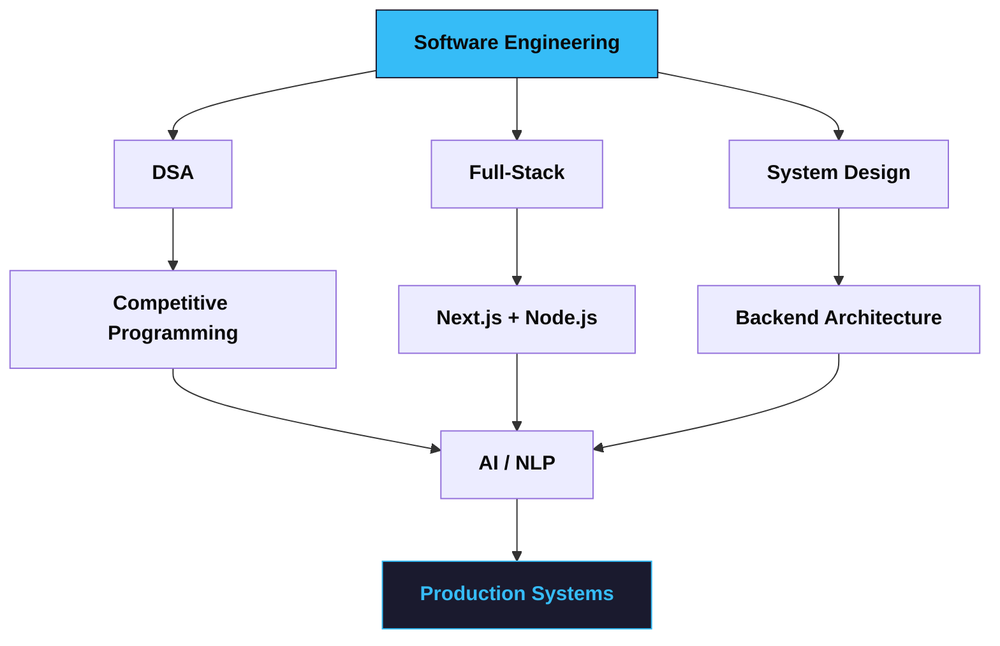

<!-- ========================================================= -->
<!--                     HERO SECTION                         -->
<!-- ========================================================= -->
<div align="center">


<br/>


<br/><br/>

<a href="https://github.com/usamabinmah12">

</a>
<a href="https://github.com/usamabinmah12?tab=followers">

</a>
<a href="https://github.com/usamabinmah12?tab=repositories">

</a>

</div>

<br/>

<!-- ========================================================= -->
<!--                    SOCIAL LINKS                           -->
<!-- ========================================================= -->
<div align="center">

<a href="mailto:usamabinmahbub12@gmail.com"></a>
<a href="https://linkedin.com/in/usamabinmahbub"></a>
<a href="https://leetcode.com/u/604ioyeBpo/"></a>
<a href="https://github.com/usamabinmah12"></a>

</div>

---

<!-- ========================================================= -->
<!--                     ABOUT ME                              -->
<!-- ========================================================= -->
<h2 align="center">⚡ About Me</h2>

<table align="center">
<tr>
<td width="55%">

```yaml
name: Usama Bin Mahbub
role: Full-Stack Developer
education: CSE Student
location: Bangladesh

focus:
  - Full-Stack Development
  - Data Structures & Algorithms
  - Competitive Programming
  - Backend Engineering
  - System Design
  - AI / NLP

currently_learning:
  - Next.js
  - Backend Architecture
  - System Design
  - AI Applications
  - NLP

mindset:
  - Learn
  - Build
  - Solve
  - Improve
```

</td>
<td width="45%" align="center">


</td>
</tr>
</table>

---

<!-- ========================================================= -->
<!--                    WHAT I DO                              -->
<!-- ========================================================= -->
<h2 align="center">🚀 What I Do</h2>

<div align="center">

|            💻 Development            |     🧠 Problem Solving    |
| :----------------------------------: | :-----------------------: |
| Build modern full-stack applications |     Solve DSA problems    |
|     React & Next.js applications     |  Competitive Programming  |
|      REST APIs & backend systems     | Algorithms & Optimization |
|       MongoDB & database design      |    ICPC-style problems    |

|    🏗️ Engineering    |        🤖 Exploration       |
| :-------------------: | :-------------------------: |
|  Backend architecture |   Artificial Intelligence   |
|     System Design     | Natural Language Processing |
| Authentication & APIs |   AI-powered applications   |
| Clean & reusable code |       Machine Learning      |

</div>

---

<!-- ========================================================= -->
<!--                    TECH STACK                             -->
<!-- ========================================================= -->
<h2 align="center">🛠️ Technology Stack</h2>

<h3 align="center">Languages</h3>
<p align="center">

</p>

<h3 align="center">Frontend</h3>
<p align="center">

</p>

<h3 align="center">Backend & Database</h3>
<p align="center">

</p>

<h3 align="center">Tools & Platforms</h3>
<p align="center">

</p>

<p align="center">


</p>

---

<!-- ========================================================= -->
<!--            CURRENTLY BUILDING & LEARNING                  -->
<!-- ========================================================= -->
<h2 align="center">🔭 Currently Building & Learning</h2>

<!--
  FIX: the old ASCII progress bars (┌──█░──┐) break alignment on GitHub
  because emoji + box-drawing characters don't render at a fixed width
  across themes/devices. Swapped for generated SVG progress bars, which
  render identically everywhere.
-->
<div align="center">

<br/>
<br/>
<br/>
<br/>


</div>

---

<!-- ========================================================= -->
<!--                   FEATURED PROJECTS                       -->
<!-- ========================================================= -->
<h2 align="center">🚀 Featured Projects</h2>

<div align="center">

<a href="https://github.com/usamabinmah12/petnest-client">

</a>
<a href="https://github.com/usamabinmah12/tiles-gallery-auth-nextjs">

</a>

</div>

<div align="center">

<a href="https://github.com/usamabinmah12/ai-verse">

</a>
<a href="https://github.com/usamabinmah12/TwitterClone">

</a>

</div>

<div align="center">

<a href="https://github.com/usamabinmah12/My-Portfolio">

</a>
<a href="https://github.com/usamabinmah12/DataStructure_Algorithm">

</a>

</div>

---

<!-- ========================================================= -->
<!--                  PROJECT DETAILS                          -->
<!-- ========================================================= -->
<h2 align="center">💎 Project Highlights</h2>

<table align="center">
<tr>
<td width="50%">

### 🐾 PetNest
Full-stack pet management platform.

**Built With**
`Next.js` `React` `MongoDB`
`Tailwind` `Better Auth` `HeroUI`

**Features**
* 🔐 Authentication
* 🐶 Pet Management
* ✏️ CRUD Operations
* 🔎 Dynamic Routing
* 📱 Responsive UI

<a href="https://github.com/usamabinmah12/petnest-client">View Repository →</a>

</td>
<td width="50%">

### 🧱 Tiles Gallery
Authenticated tile/product gallery.

**Built With**
`Next.js` `React` `MongoDB`
`Tailwind` `DaisyUI` `Better Auth`

**Features**
* 🔐 Authentication
* 🧱 Product Gallery
* 🔎 Detail Pages
* 📝 Form Validation
* 🔔 Notifications

<a href="https://github.com/usamabinmah12/tiles-gallery-auth-nextjs">View Repository →</a>

</td>
</tr>
<tr>
<td width="50%">

### 🐦 TwitterClone
Backend-focused social media project.

**Built With**
`C#` `.NET`

**Focus**
* Domain Driven Design
* Clean Architecture
* Backend Engineering
* Object-Oriented Design

<a href="https://github.com/usamabinmah12/TwitterClone">View Repository →</a>

</td>
<td width="50%">

### 🤖 AI Verse
AI-focused web application.

**Built With**
`Next.js` `React` `JavaScript`

**Focus**
* Modern UI
* AI-powered functionality
* Frontend architecture
* Interactive experience

<a href="https://github.com/usamabinmah12/ai-verse">View Repository →</a>

</td>
</tr>
</table>

---

<!-- ========================================================= -->
<!--              COMPETITIVE PROGRAMMING                     -->
<!-- ========================================================= -->
<h2 align="center">🧠 Competitive Programming</h2>

<p align="center">
I enjoy competitive programming because it teaches me how to think about
<strong>logic, optimization, complexity and edge cases.</strong>
</p>

<div align="center">


</div>

<br/>

<p align="center">


</p>

---

<!-- ========================================================= -->
<!--                  LEETCODE                                 -->
<!-- ========================================================= -->
<h2 align="center">⚔️ Coding Profiles</h2>

<div align="center">
<a href="https://leetcode.com/u/604ioyeBpo/">

</a>
</div>

---

<!-- ========================================================= -->
<!--                  GITHUB ANALYTICS                         -->
<!-- ========================================================= -->
<h2 align="center">📊 GitHub Analytics</h2>

<p align="center">


</p>

---

<h2 align="center">🔥 Contribution Streak</h2>
<p align="center">

</p>

---

<!-- ========================================================= -->
<!--                 ACTIVITY GRAPH                            -->
<!-- ========================================================= -->
<h2 align="center">📈 Contribution Activity</h2>
<p align="center">

</p>

---

<!-- ========================================================= -->
<!--                    TROPHIES                               -->
<!-- ========================================================= -->
<h2 align="center">🏆 GitHub Trophies</h2>
<p align="center">

</p>

---

<!-- ========================================================= -->
<!--                 CONTRIBUTION SNAKE                       -->
<!-- ========================================================= -->
<h2 align="center">🐍 My Contributions</h2>

<!--
  FIX: this was pointing at platane/snk's own demo output, so it showed
  the tool author's contribution grid instead of yours. It now points
  at YOUR repo's generated output. This only works once you add the
  "snk" GitHub Action to a repo on your account (usually a repo named
  usamabinmah12/usamabinmah12) — see https://github.com/Platane/snk
  for the one-time workflow setup. Until that Action runs at least once,
  this image will 404.
-->
<p align="center">

</p>

---

<!-- ========================================================= -->
<!--                PROFILE DETAILS                            -->
<!-- ========================================================= -->
<h2 align="center">📌 Profile Overview</h2>

<p align="center">

</p>

<p align="center">


</p>

---

<!-- ========================================================= -->
<!--                     ROADMAP                               -->
<!-- ========================================================= -->
<h2 align="center">🎯 Current Roadmap</h2>

<!--
  FIX: the old box-drawing diagram used manual spacing that shifts and
  breaks on narrow screens / different fonts. Replaced with a Mermaid
  flowchart, which GitHub renders natively as an actual diagram (and
  it stays readable on mobile).
-->


<br/>

* [x] Build full-stack applications
* [x] Work with React / Next.js
* [x] Build REST APIs
* [x] Work with MongoDB
* [x] Authentication systems
* [ ] Master advanced DSA
* [ ] Improve Competitive Programming
* [ ] Deepen System Design
* [ ] Build scalable backend systems
* [ ] Learn advanced NLP
* [ ] Build AI-powered applications
* [ ] Contribute to Open Source
* [ ] Become a stronger Software Engineer

---

<!-- ========================================================= -->
<!--                  DEVELOPER PHILOSOPHY                     -->
<!-- ========================================================= -->
<h2 align="center">💡 Developer Philosophy</h2>

<p align="center">

</p>

<div align="center">

> **Don't just write code. Understand the problem.**

> **Don't just build projects. Build things that teach you something.**

> **Don't chase perfection. Chase continuous improvement.**

</div>

---

<!-- ========================================================= -->
<!--                    GITHUB REPOSITORIES                    -->
<!-- ========================================================= -->
<h2 align="center">📚 Explore My Work</h2>

<div align="center">
<a href="https://github.com/usamabinmah12?tab=repositories"></a>
<a href="https://github.com/usamabinmah12/DataStructure_Algorithm"></a>
<a href="https://github.com/usamabinmah12/My-Portfolio"></a>
</div>

---

<!-- ========================================================= -->
<!--                    CONNECT                                -->
<!-- ========================================================= -->
<h2 align="center">🤝 Let's Connect</h2>

<p align="center">
<a href="mailto:usamabinmahbub12@gmail.com"></a>
<a href="https://linkedin.com/in/usamabinmahbub"></a>
<a href="https://leetcode.com/u/604ioyeBpo/"></a>
<a href="https://github.com/usamabinmah12"></a>
</p>

---

<!-- ========================================================= -->
<!--                       FOOTER                               -->
<!-- ========================================================= -->
<div align="center">


<br/><br/>


</div>
